drupal-tools
===

>Plugins de Claude Code para desarrollo con Drupal

[![version][version-badge]][changelog]
[![Licencia][license-badge]][license]
[![Código de conducta][conduct-badge]][conduct]
[![Donate][donate-badge]][donate-url]

---

## Descripción

Colección de plugins para Claude Code orientados al desarrollo con Drupal.
El marketplace ofrece tres plugins modulares:

| Plugin | Descripción |
|--------|-------------|
| **drupal-global** | Base común: MCPs (Context7, Obsidian, Playwright), agentes, comandos y skills compartidos |
| **drupal-backend** | Especializado en backend: módulos, APIs, servicios, migraciones (requiere drupal-global) |
| **drupal-frontend** | Especializado en frontend: theming, Twig, CSS/JS, accesibilidad (requiere drupal-global) |

Los plugins `drupal-backend` y `drupal-frontend` **requieren drupal-global**. Debes instalar `drupal-global` primero, o instalarlos todos juntos si haces desarrollo full-stack.

---

## Arquitectura

### Componentes de un plugin

Los plugins de Claude Code pueden incluir los siguientes tipos de componentes:

| Componente | Qué es | Ejemplo |
|------------|--------|---------|
| **Agentes** | Subagentes especializados que Claude invoca automáticamente según el contexto de la tarea. Tienen su propio prompt de sistema, herramientas y modelo. | El agente `context7` consulta documentación actualizada antes de responder. |
| **Comandos** | Atajos invocables con `/nombre` que ejecutan instrucciones predefinidas. Útiles para tareas repetitivas o flujos guiados. | `/drupal-setup` configura un entorno de proyecto Drupal. |
| **Skills** | Similares a los comandos pero con estructura más completa: pueden incluir archivos de referencia, scripts auxiliares y subdirectorios. | La skill `drupal-setup` incluye plantillas de CLAUDE.md y README.md. |
| **Hooks** | Scripts que se ejecutan automáticamente antes o después de que Claude use una herramienta. Actúan como guardrails de seguridad. | Un hook `PreToolUse` que impide modificar archivos en `vendor/`. |
| **MCPs** | Servidores del Model Context Protocol que conectan a Claude con herramientas externas (APIs, bases de datos, navegadores, etc.). | Context7 para documentación, Playwright para automatizar un navegador. |

### Estructura de directorios

```
drupal-tools/
├── .claude-plugin/
│   └── marketplace.json            # Registro de los 3 plugins
├── drupal-global/                  # Plugin base con componentes compartidos
│   ├── .claude-plugin/plugin.json
│   ├── .mcp.json                   # MCPs: Context7, Obsidian, Playwright
│   ├── agents/
│   │   └── context7.md             # Agente experto en documentación
│   ├── commands/
│   │   ├── drupal-setup.md         # Comando para invocar la skill drupal-setup
│   │   └── update-changelog.md     # Comando para gestionar CHANGELOG.md
│   ├── skills/
│   │   ├── drupal-setup/           # Skill de configuración de proyectos Drupal
│   │   │   ├── SKILL.md            # Instrucciones de la skill
│   │   │   └── templates/          # Plantillas (CLAUDE.md, README.md)
│   │   └── change-name/            # Skill de renombrado de módulos/temas
│   │       └── SKILL.md            # Instrucciones de la skill
│   └── hooks/
│       ├── hooks.json              # Configuración de hooks compartidos
│       └── scripts/
│           └── protect-files.sh     # Protección: node_modules, vendor, .git
├── drupal-backend/                 # Plugin backend (depende de drupal-global)
│   ├── .claude-plugin/plugin.json
│   ├── agents/
│   │   └── drupal-backend.md       # Agente experto en backend Drupal
│   ├── commands/                   # (vacío por ahora, preparado para futuros comandos)
│   ├── skills/                     # (vacío por ahora, preparado para futuros skills)
│   └── hooks/
│       ├── hooks.json              # Configuración de hooks backend
│       └── scripts/
│           └── protect-files.sh     # Protección: core, default.settings.php
└── drupal-frontend/                # Plugin frontend (depende de drupal-global)
    ├── .claude-plugin/plugin.json
    ├── agents/
    │   └── drupal-frontend.md      # Agente experto en frontend Drupal
    ├── commands/
    │   └── component.md            # Generador de SDC (Single Directory Components)
    ├── skills/                     # (vacío por ahora, preparado para futuros skills)
    └── hooks/
        ├── hooks.json              # Configuración de hooks frontend
        └── scripts/
            └── protect-files.sh     # Protección: core, dist, build
```

### Sistema modular

Los tres plugins están **completamente separados**:

- ✅ **Sin duplicación**: Al instalar drupal-global, los MCPs solo se registran una vez
- ✅ **Instalación selectiva**: Instala solo lo que necesites
- ✅ **Mantenimiento independiente**: Cada plugin puede actualizarse por separado

```mermaid
graph TB
    subgraph global["🌐 drupal-global (requerido)"]
        direction TB
        mcp["📦 MCPs<br/>Context7, Obsidian, Playwright"]
        agent_g["🤖 Agent: context7"]
        cmd_g["⚡ Commands<br/>drupal-setup, update-changelog"]
        skill_g["🛠️ Skills<br/>drupal-setup, change-name"]
        hook_g["🛡️ Hooks: protección base"]
    end

    subgraph backend["⚙️ drupal-backend (opcional)"]
        direction TB
        agent_b["🤖 Agent: drupal-backend"]
        hook_b["🛡️ Hooks backend"]
    end

    subgraph frontend["🎨 drupal-frontend (opcional)"]
        direction TB
        agent_f["🤖 Agent: drupal-frontend"]
        cmd_f["⚡ Command: component"]
        hook_f["🛡️ Hooks frontend"]
    end

    global -.->|requiere| backend
    global -.->|requiere| frontend

    style global fill:#e1f5e1,stroke:#4caf50,stroke-width:3px
    style backend fill:#e3f2fd,stroke:#2196f3,stroke-width:2px
    style frontend fill:#fff3e0,stroke:#ff9800,stroke-width:2px
```



> **Nota**: `drupal-backend` y `drupal-frontend` requieren que `drupal-global` esté instalado para funcionar correctamente.

---

## Requisitos

- [Claude Code](https://docs.anthropic.com/en/docs/claude-code) instalado.
- [Node.js](https://nodejs.org/) >= 18 (necesario para los servidores MCP).

---

## Instalación

### 1. Añadir el marketplace

```bash
claude plugin marketplace add https://github.com/oscarnovasf/claude-drupal-plugin.git
```

### 2. Instalar el plugin que necesites

#### Opción A: Solo componentes base
```bash
claude plugin install drupal-global@drupal-tools
```

#### Opción B: Backend (requiere drupal-global)
```bash
claude plugin install drupal-global@drupal-tools
claude plugin install drupal-backend@drupal-tools
```

#### Opción C: Frontend (requiere drupal-global)
```bash
claude plugin install drupal-global@drupal-tools
claude plugin install drupal-frontend@drupal-tools
```

#### Opción D: Full-stack (backend + frontend)
```bash
claude plugin install drupal-global@drupal-tools
claude plugin install drupal-backend@drupal-tools
claude plugin install drupal-frontend@drupal-tools
```

> **Importante**: `drupal-global` contiene los MCPs y componentes comunes. Al tener los 3 plugins separados, los MCPs solo se cargan **una vez** sin duplicación.
>
> **Nota**: Debes instalar `drupal-global` **antes** de instalar `drupal-backend` o `drupal-frontend`. Claude Code aún no soporta dependencias automáticas entre plugins (ver sección [Nota técnica sobre dependencias](#nota-técnica-sobre-dependencias)).

### 3. Scopes de instalación

Puedes elegir dónde instalar cada plugin:

```bash
# Personal (disponible en todos tus proyectos) - por defecto
claude plugin install drupal-backend@drupal-tools --scope user

# Proyecto (compartido con el equipo via git)
claude plugin install drupal-backend@drupal-tools --scope project

# Local (solo este proyecto, no se versiona)
claude plugin install drupal-backend@drupal-tools --scope local
```

### 4. Actualizar el plugin

Para actualizar a la última versión publicada:

```bash
# Actualizar drupal-global (hazlo primero si tienes backend o frontend instalados)
claude plugin update drupal-global@drupal-tools

# Actualizar un plugin específico
claude plugin update drupal-backend@drupal-tools
claude plugin update drupal-frontend@drupal-tools

# Actualizar todos los plugins del marketplace
claude plugin update --all
```

> **Nota**: El comando `update` descarga e instala la versión más reciente desde el marketplace. Si has modificado el plugin localmente, esos cambios se perderán. Para desarrollo activo del plugin, consulta la sección [Desarrollo](#desarrollo).

---

## Plugin drupal-global

El plugin `drupal-global` es la base común para `drupal-backend` y `drupal-frontend`.
Contiene todos los MCPs, agentes, comandos y skills compartidos.

### MCPs incluidos

| MCP | Descripción | Configuración |
|-----|-------------|---------------|
| **Context7** | Documentación actualizada de librerías | API key opcional |
| **Obsidian** | Integración con vault de Obsidian | Requiere `OBSIDIAN_VAULT_PATH` |
| **Playwright** | Automatización de navegador | Ninguna |

### Agentes compartidos

| Agente | Descripción |
|--------|-------------|
| **context7** | Experto en documentación actualizada de librerías. Usa Context7 para verificar APIs, versiones y buenas prácticas antes de responder. |

### Comandos compartidos

| Comando | Descripción |
|---------|-------------|
| **/drupal-setup** | Configurar, incorporar o reiniciar un entorno de proyecto Drupal. Detecta el escenario y guía el flujo apropiado. |
| **/update-changelog** | Generar y mantener CHANGELOG.md con formato Keep a Changelog. Detecta versión automáticamente, sugiere siguiente versión según semantic versioning, evita duplicados y puede actualizar README.md. |

### Skills compartidos

| Skill | Descripción |
|-------|-------------|
| **drupal-setup** | Ciclo de vida completo de desarrollo Drupal: detección de escenario, configuración de entorno, generación de CLAUDE.md y README.md adaptados al proyecto, instalación de Drupal con DDEV. Incluye plantillas en `templates/`. |
| **change-name** | Renombra completamente un módulo o tema de Drupal. Puede ejecutarse desde la raíz del proyecto (busca y selecciona módulos/temas custom) o desde la carpeta del módulo/tema. Actualiza nombres de archivos, contenido interno y renombra la carpeta del proyecto. Maneja ambas variantes (snake_case y kebab-case). |

### Hooks de protección base

La lógica de protección está en `drupal-global/hooks/scripts/protect-files.sh`.
Archivos protegidos contra modificación:
- `*/node_modules/*`
- `*/vendor/*`
- `*/.git/*`

Para añadir o quitar patrones, edita directamente el array
`PROTECTED_PATTERNS` dentro del script.

---

## Plugins

### drupal-backend

Plugin especializado en desarrollo backend.

#### Agentes

| Agente | Descripción |
|--------|-------------|
| **drupal-backend** | Experto en backend Drupal: módulos custom, plugins, servicios, Entity API, migraciones, configuración y seguridad. |

#### Hooks de protección adicionales

Script: `drupal-backend/hooks/scripts/protect-files.sh`. Además de los hooks
compartidos, protege:
- `*/core/*` (núcleo de Drupal)
- `*/sites/default/default.settings.php`
- `*/sites/default/default.services.yml`
- `*/sites/default/settings.ddev.php`

---

### drupal-frontend

Plugin especializado en desarrollo frontend.

#### Agentes

| Agente | Descripción |
|--------|-------------|
| **drupal-frontend** | Experto en frontend Drupal: theming, Twig, CSS/JS, SDC, accesibilidad WCAG 2.1 AA, responsive design y Core Web Vitals. |

#### Comandos

| Comando | Descripción |
|---------|-------------|
| **/component** | Genera un Single Directory Component (SDC) con template Twig, estilos, JavaScript y schema de componente. |

#### Hooks de protección adicionales

Script: `drupal-frontend/hooks/scripts/protect-files.sh`. Además de los hooks
compartidos, protege:
- `*/core/*` (núcleo de Drupal)
- `*/dist/*` (archivos compilados)
- `*/build/*` (archivos de build)

---

## Configuración

### Variables de entorno

Los MCPs compartidos pueden requerir configuración adicional.

#### Context7 (opcional)

Context7 funciona sin API key (con límites de rate). Para obtener cuota
adicional, genera tu key en [context7.com](https://context7.com) y añade la
siguiente variable a tu `~/.zshrc` o `~/.zshenv`:

```bash
export CONTEXT7_API_KEY="tu-api-key-aquí"
```

#### Obsidian (opcional)

El MCP de Obsidian necesita la ruta a tu vault. Añade la siguiente variable a tu
`~/.zshrc` o `~/.zshenv`:

```bash
export OBSIDIAN_VAULT_PATH="/ruta/a/tu/vault/de/Obsidian"
```

Ejemplo en macOS con iCloud:

```bash
export OBSIDIAN_VAULT_PATH="$HOME/Library/Mobile Documents/com~apple~CloudDocs/Obsidian/MiVault"
```

### Permisos

Los permisos se configuran a nivel de proyecto o usuario, no de plugin.
Claude Code pedirá confirmación la primera vez que un MCP intente ejecutarse.
Para pre-autorizar herramientas, configura los permisos en el scope que
prefieras:

```json
{
  "permissions": {
    "allow": [
      "mcp__context7",
      "mcp__playwright",
      "mcp__obsidian__*"
    ],
    "deny": []
  }
}
```

| Scope | Archivo | Uso |
|-------|---------|-----|
| Usuario | `~/.claude/settings.json` | Permisos globales en todos tus proyectos |
| Proyecto | `.claude/settings.json` | Compartidos con el equipo (versionados en git) |
| Local | `.claude/settings.local.json` | Solo para ti en este proyecto (gitignored) |

> **Nota**: Estos archivos de settings son del proyecto donde usas Claude Code,
> no del marketplace. Cada proyecto Drupal donde trabajes puede tener su propia
> configuración de permisos.

---

## Cómo funciona la arquitectura modular

La arquitectura se basa en **3 plugins independientes** dentro del mismo marketplace:

1. **drupal-global** es un plugin standalone que contiene:
   - MCPs (Context7, Obsidian, Playwright)
   - Agente context7
   - Comandos y skills compartidos
   - Hooks de protección base

2. **drupal-backend** y **drupal-frontend** son plugins especializados que:
   - Añaden sus propios agentes, comandos, skills y hooks específicos
   - **Requieren** que drupal-global esté instalado (validación manual del usuario)
   - No duplican los MCPs porque solo drupal-global los registra

3. El `source` de los tres plugins apunta a la **raíz del marketplace** (`"./"`),
   permitiendo que todos accedan a sus respectivos directorios tras la instalación.

Esta arquitectura garantiza que los MCPs solo se carguen **una vez**, evitando
duplicación y conflictos.

### Nota técnica sobre dependencias

**Estado actual (2025)**: Claude Code aún no soporta un campo `dependencies`
nativo entre plugins (ver [issue #9444](https://github.com/anthropics/claude-code/issues/9444)).

**Nuestra solución**: Usamos el workaround recomendado por la comunidad:
- Los 3 plugins usan `"source": "./"` (apuntan a la raíz del marketplace)
- Configuramos `"strict": false` para permitir rutas flexibles
- `drupal-global` registra los MCPs una sola vez
- `drupal-backend` y `drupal-frontend` solo registran sus componentes específicos

**Ventajas de nuestra arquitectura**:
- ✅ Sin duplicación de MCPs (están solo en drupal-global)
- ✅ Instalación modular (instala solo lo que necesites)
- ✅ Validación exitosa con `claude plugin validate`
- ✅ Preparado para migrar a `dependencies` cuando esté disponible

**Limitación actual**: Los usuarios deben instalar manualmente `drupal-global`
antes de `drupal-backend` o `drupal-frontend`. Cuando Claude Code implemente el
sistema de dependencias nativo, actualizaremos el marketplace para usar:

```json
{
  "name": "drupal-backend",
  "dependencies": {
    "drupal-global": "^1.0.0"
  }
}
```

Esto permitirá la instalación automática de dependencias, pero por ahora nuestra
solución es la mejor práctica disponible.

---

## Preguntas frecuentes

### ¿Qué pasa con los MCPs si no configuro las variables de entorno?

- **Context7**: Funciona sin API key, con límites de rate.
- **Obsidian**: No se iniciará si `OBSIDIAN_VAULT_PATH` no está definida. El
  resto del plugin funciona con normalidad.
- **Playwright**: Funciona sin configuración adicional.

---

## Desarrollo

### Validar el marketplace

```bash
claude plugin validate .
```

### Probar localmente

```bash
claude plugin marketplace add ./
claude plugin install drupal-backend@drupal-tools
```

---
⌨️ con ❤️ por [Óscar Novás][mi-web] 😊

[mi-web]: https://oscarnovas.com "for developers"

[version]: v1.1.0
[version-badge]: https://img.shields.io/badge/Versión-1.1.0-blue.svg

[license]: LICENSE.md
[license-badge]: https://img.shields.io/badge/Licencia-GPLv3+-green.svg "Leer la licencia"

[conduct]: CODE_OF_CONDUCT.md
[conduct-badge]: https://img.shields.io/badge/C%C3%B3digo%20de%20Conducta-2.0-4baaaa.svg "Código de conducta"

[changelog]: CHANGELOG.md "Histórico de cambios"

[donate-badge]: https://img.shields.io/badge/Donaci%C3%B3n-PayPal-red.svg
[donate-url]: https://paypal.me/oscarnovasf "Haz una donación"
