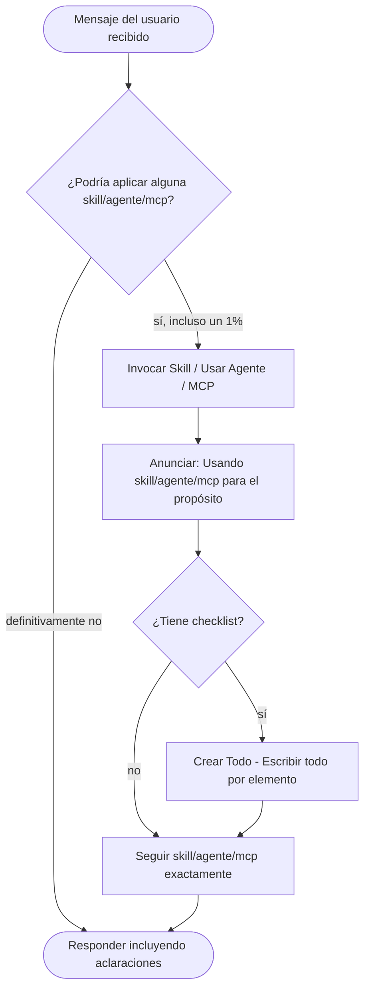

# Guía de Claude para {{PROJECT_NAME}}

Este es un proyecto Drupal {{DRUPAL_VARIANT}}.
Sigue estas directrices al trabajar en este código.

## General
- Haz las preguntas que necesites si no comprendes o necesitas más contexto.
- Comprueba si tienes skills o agentes para la solución de las tareas y úsalos.
- Prioriza el uso de agentes como context7 para obtener mejor información sobre
  librerías, frameworks u otras herramientas.
- No seas halagador ni te disculpes, haz tu tarea. Evita frases del tipo
  "Tienes razón...", "Lo siento..."



## Comandos de Build/Lint/Test

- **Build**: `ddev composer install`
- **Instalar**: `ddev drush site:install --existing-config`
- **Lint**:
  - Si el proyecto tiene `/phpcs.xml` o `/phpcs.xml.dist`: `ddev exec phpcs`
  - En caso contrario: `ddev exec phpcs --standard=Drupal web/modules/custom`
- **Análisis estático**:
  - Si el proyecto tiene `/phpstan.neon` o `phpstan.neon.dist`: `ddev exec phpstan` o `ddev phpstan` (si existe el comando)
  - En caso contrario: `ddev exec phpstan analyse --level 6 web/modules/custom`
- **Ejecutar un test individual**:
  - Si el proyecto tiene `/phpunit.xml` o `/phpunit.xml.dist`: `ddev exec phpunit --filter Test ruta/al/test` o `ddev phpunit <testsuite>` (si existe el comando)
  - En caso contrario: `ddev exec phpunit -c web/core/phpunit.xml.dist --filter Test ruta/al/test`

## Gestión de Configuración

- **Exportar configuración**: `ddev drush config:export -y`
- **Importar configuración**: `ddev drush config:import -y`
- **Importar configuración parcial**: `ddev drush config:import --partial --source=web/modules/custom/mimodulo/config/install`
- **Verificar configuración**: `ddev drush config:export --diff`
- **Ver detalles de config**: `ddev drush config:get [nombre.config]`
- **Cambiar valor de config**: `ddev drush config:set [nombre.config] [clave] [valor]`
- **Instalar desde config**: `ddev drush site:install --existing-config`
- **Obtener directorio de sync de config**: `ddev drush status --field=config-sync`

## Comandos de Desarrollo

- **Listar módulos disponibles**: `ddev drush pm:list [--filter=FILTRO]`
- **Listar módulos habilitados**: `ddev drush pm:list --status=enabled [--filter=FILTRO]`
- **Descargar un módulo Drupal**: `ddev composer require drupal/[nombre_modulo]`
- **Instalar un módulo Drupal**: `ddev drush en [nombre_modulo]`
- **Limpiar caché**: `ddev drush cache:rebuild` o. `ddev cr` (si existe el comando)
- **Inspeccionar registros**: `ddev drush watchdog:show --count=20`
- **Eliminar registros**: `ddev drush watchdog:delete all`
- **Ejecutar cron**: `ddev drush cron`
- **Mostrar estado**: `ddev drush status`

## Gestión de Entidades

- **Ver campos de una entidad**: `ddev drush field:info [tipo_entidad] [bundle]`

## Buenas Prácticas

- Si se realizan cambios de configuración en el config/install de un módulo, estos también deben aplicarse a la configuración activa
- Siempre exportar la configuración después de hacer cambios: `ddev drush config:export -y`
- Revisar las diferencias de configuración antes de importar
- Si un módulo proporciona configuración de instalación, debe hacerse vía `config/install` y no mediante `hook_install`
- Intentar usar módulos contribuidos para la funcionalidad, en lugar de replicarla en un módulo personalizado
- Si phpcs/phpstan/phpunit no están disponibles, deben instalarse con `ddev composer require --dev drupal/core-dev`
- Evita el uso de métodos estáticos dentro de las clases, usa un enfoque de
  inyección de dependencias y comprueba antes si ya existe la dependencia en la
  propia clase o clases a las que extiende.

## Directrices de Estilo de Código

- **Versión PHP**: Compatibilidad con 8.3+ requerida
- **Estándar de codificación**: Estándares de codificación de Drupal
- **Indentación**: 2 espacios, sin tabulaciones (salvo en archivos de composer.json, composer.custom.json, composer.*.json... que usaremos 4 espacios)
- **Longitud de línea**: Máximo 120 caracteres
- **Comentarios**: Máximo 80 caracteres por línea, siempre terminando con punto
- **Namespaces**: Estándar PSR-4, `Drupal\{nombre_modulo}`
- **Tipos**: Tipado estricto con características de PHP 8, union types cuando sea necesario
- **Documentación**: Requerida para clases y métodos con PHPDoc
- **Estructura de clases**: Propiedades antes de métodos, inyección de dependencias vía constructor
- **Nomenclatura**: CamelCase para clases/métodos/propiedades, snake_case para variables, ALL_CAPS para constantes
- **Manejo de errores**: Tipos de excepción específicos con anotaciones `@throws`, mensajes significativos
- **Plugins**: Seguir las convenciones de plugins de Drupal con atributos para la definición

## Trabajar con DDEV

Este proyecto usa DDEV para desarrollo local. Todos los comandos deben ir prefijados con `ddev`:

- **SSH al contenedor**: `ddev ssh`
- **Ejecutar PHP**: `ddev exec php script.php`
- **Ver registros**: `ddev logs`
- **Reiniciar**: `ddev restart`

## Desarrollo Orientado a Configuración

Cuando sea posible, realizar cambios mediante archivos de configuración en lugar
de interacciones con la base de datos:

1. **Añadir un tipo de contenido**: Crear archivos YAML en `config/sync/` o `web/modules/custom/mimodulo/config/install/`
2. **Añadir campos**: Crear YAML de configuración de campos
3. **Cambiar ajustes**: Modificar YAML de configuración existente
4. **Instalar módulos**: Añadir a `core.extension.yml` (pero es preferible usar `composer require` + `drush en`)

## Tareas Comunes

### Crear un Módulo Personalizado

```bash
ddev drush generate module
```

O crear manualmente:
```
web/modules/custom/mimodulo/
├── mimodulo.info.yml
├── mimodulo.module
├── composer.json
└── src/
```

### Añadir un Campo a un Tipo de Contenido

```bash
ddev drush generate field
```

Luego exportar la configuración:
```bash
ddev drush config:export -y
```

### Crear una Vista

1. Usar la interfaz de Drupal para crear la vista
2. Exportar la configuración:
   ```bash
   ddev drush config:export -y
   ```
3. La config de la vista estará en `config/sync/views.view.[id_vista].yml`

### Depuración

- **Habilitar logging detallado** (ya configurado en settings.php para DDEV)
- **Consultar registros de watchdog**: `ddev drush watchdog:show`
- **Habilitar módulo devel**: `ddev composer require --dev drupal/devel && ddev drush en devel -y`
- **Usar Xdebug**: se activa con `ddev xdebug on`

## Flujo de Trabajo con Git (sólo si estamos usando git)

1. Crear rama de funcionalidad
2. Realizar cambios
3. Exportar configuración si es necesario
4. Probar localmente
5. Hacer commit con mensaje descriptivo
6. Hacer push y crear PR (si existe repositorio remoto)

Al trabajar en este código, priorizar la adherencia a los patrones y convenciones de Drupal.
